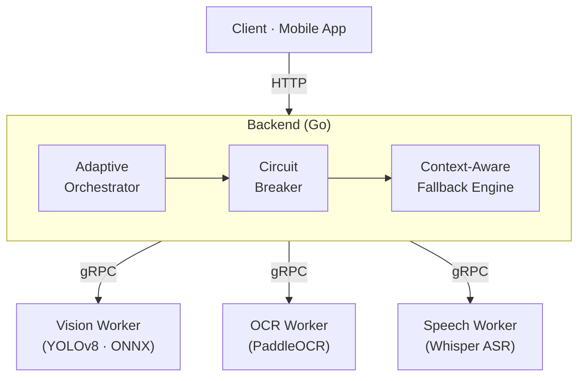

# RAMA — Artifact Package

> **Rancang Bangun dan Evaluasi Resilient AI Microservices Architecture (RAMA) untuk Inferensi Multi-Model pada Lingkungan Single-Node Resource-Constrained**

Repository ini memuat paket artefak akademik yang telah disanitasi untuk mendukung keterlacakan implementasi, audit metodologi eksperimen, dan replikasi terbatas. Bukan repository produksi TemanDifa.

---

## Apa itu RAMA?

RAMA (*Resilient AI Microservices Architecture*) adalah arsitektur *backend* yang menjaga tiga layanan inferensi AI — **Vision** (YOLOv8), **OCR** (PaddleOCR), dan **Speech/ASR** (Whisper) — tetap dapat memberi respons berguna meski satu atau lebih worker sedang tertekan resource atau gagal total, pada satu node dengan sumber daya terbatas (2 vCPU / 4 GB RAM).

Setiap worker berjalan sebagai container independen (isolasi proses & memori penuh); kegagalan satu worker tidak menjatuhkan yang lain. Rasional desain lengkap ada di [`docs/adr/`](docs/adr/).

---

## Temuan Utama

Dibandingkan dengan *Static Resilience Baseline* (SRB) — konfigurasi ketahanan statis tanpa orkestrasi adaptif — pada 180 run (9 skenario × 2 kondisi × 10 repetisi):

| Skenario | Metrik | SRB | RAMA | Perubahan |
|---|---|---:|---:|---:|
| Steady State (tanpa gangguan) | p95 latency | 25.142 ms | 24.996 ms | −0,6% (overhead minimal) |
| B2 — Speech worker dihentikan | Partial Availability | 12,41% | 100% | +87,6 poin persentase |
| B2 — Speech worker dihentikan | Time-to-Fallback Stabilization | 267,5 s | 7,3 s | −97,3% |
| C2 — kegagalan beruntun (vision+speech) | Partial Availability | 7,63% | 100% | +92,4 poin persentase |

RAMA menunjukkan pola ketahanan yang lebih baik dibandingkan SRB pada mayoritas skenario, terutama pada ketidaktersediaan layanan (Kelas B) dan kegagalan beruntun (C2), dengan overhead minimal pada kondisi tanpa gangguan. Hasil tidak seragam di semua metrik — misalnya Time-to-Recovery pada C2 sedikit lebih lambat pada RAMA. Lihat data lengkap dan uji Wilcoxon per metrik di [`experiments/processed/statistical_tests.csv`](experiments/processed/statistical_tests.csv) dan [`data_dictionary.md`](experiments/processed/data_dictionary.md).

---

## Hasil Eksperimen

| Metrik | Nilai |
|---|---|
| Rancangan | 9 skenario × 2 kondisi × 10 repetisi |
| Run valid | **180 / 180 (100%)** |
| Tanggal eksperimen | 2026-06-27 s.d. 2026-06-29 |
| Baris data pascaproses | 68.776 baris |
| Commit rujukan | [`0538f79`](deployments/docker-compose.yml) |
| Manifest | `v1.0` — `automation/manifests/vps-main-180.yaml` |

---

## Isi Repository

### Arsitektur & Kontrak

| Path | Isi |
|---|---|
| `docs/adr/` | 4 Architectural Decision Record RAMA (ADR-001 s.d. ADR-004) |
| `proto/` | Kontrak gRPC/Protocol Buffers (3 proto: vision, ocr, speech) |

### Implementasi

| Path | Isi |
|---|---|
| `backend/` | Kode sumber backend RAMA (Go): config, circuit breaker, orchestrator, AI service, fallback, classifier |
| `workers/` | Kode sumber AI workers (Python): Vision (YOLOv8), OCR (PaddleOCR), Speech (Whisper) |
| `deployments/` | Docker Compose tersanitasi — treatment & static-resilience |

### Eksperimen

| Path | Isi |
|---|---|
| `automation/manifests/` | Manifest eksperimen 180 run (`vps-main-180.yaml`) + pilot |
| `automation/experimentctl/` | 8 skrip otomasi: runner, state machine, k6, fault, invalidator, validator, statistik, screenshot |
| `automation/schemas/` | 4 JSON Schema validasi data eksperimen |
| `experiments/k6/` | 5 skrip beban k6 per kelas skenario (SS, A, B, C) |
| `experiments/fault-injection/` | 8 skrip injeksi fault manual (A1–A3, B1–B3, C1, C2) |
| `experiments/recovery/` | Skrip pemulihan worker setelah fault |
| `experiments/calibration/` | Hasil kalibrasi beban — dasar keputusan 5 VU |
| `experiments/postprocess/` | 10 skrip pipeline komputasi metrik (latency, PA, TFS, TTR, SLO, throughput) |

### Hasil & Bukti

| Path | Isi |
|---|---|
| `experiments/processed/` | `final_summary.csv` (180 run) · `paired_summary.csv` (90 pasangan) · `statistical_tests.csv` (63 uji) · `data_dictionary.md` |
| `experiments/evidence/screenshots/` | 18 screenshot Grafana — 1 per skenario × kondisi, fase fault_active |
| `experiments/evidence/logs/` | 18 log backend representatif — fault_active, IP disanitasi |

---

## Mulai dari Sini

Pilih jalur sesuai kebutuhan Anda:

| Anda ingin... | Mulai dari |
|---|---|
| Melihat daftar lengkap artefak yang tersedia | [`ARTIFACT_MANIFEST.md`](ARTIFACT_MANIFEST.md) |
| Mereplikasi sebagian eksperimen | [`REPRODUCIBILITY.md`](REPRODUCIBILITY.md) |
| Memahami keputusan arsitektural RAMA | [`docs/adr/`](docs/adr/) |
| Memeriksa hasil statistik lengkap | [`experiments/processed/`](experiments/processed/) |
| Melihat bukti observabilitas (Grafana/log) | [`experiments/evidence/`](experiments/evidence/) |

---

## Batasan

Repository ini tidak memuat credential, token, private key, IP publik/privat, domain privat, dump database, log mentah penuh, atau riwayat commit repository privat. Lihat [`SECURITY.md`](SECURITY.md) untuk kebijakan sanitasi lengkap.
